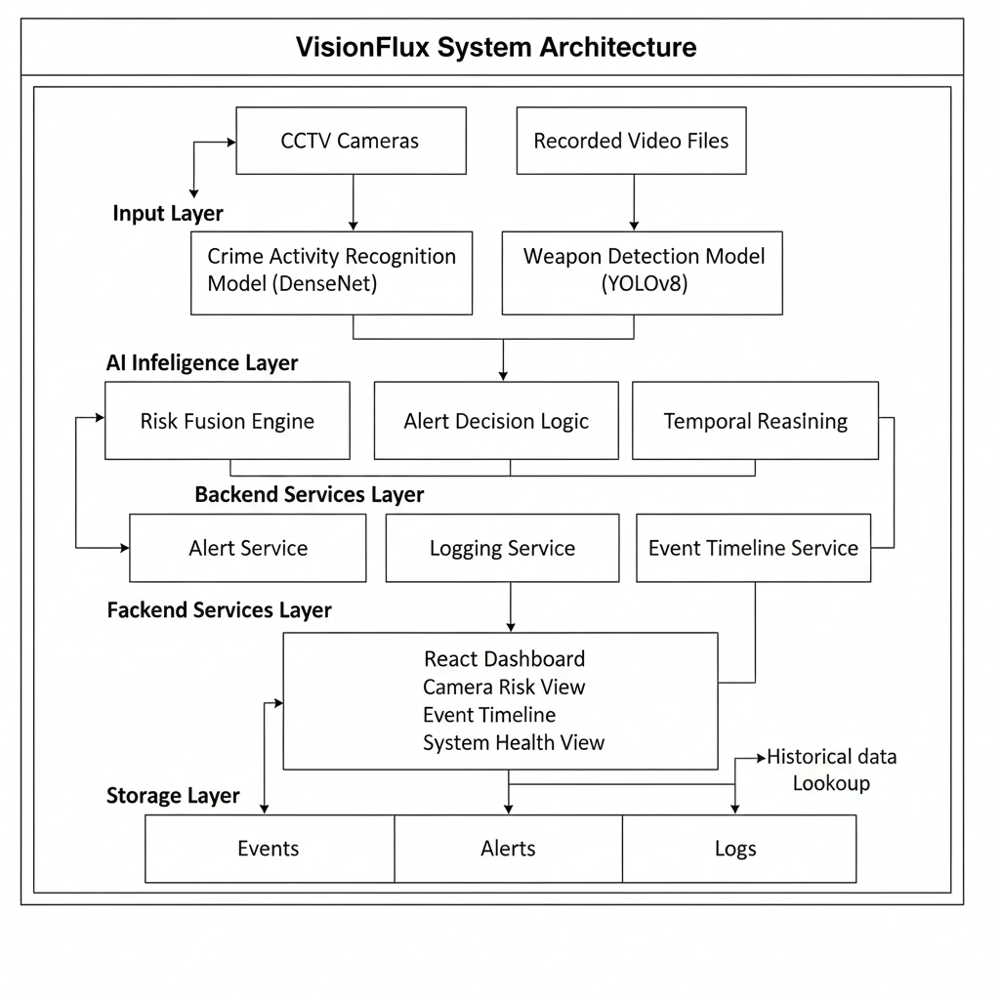
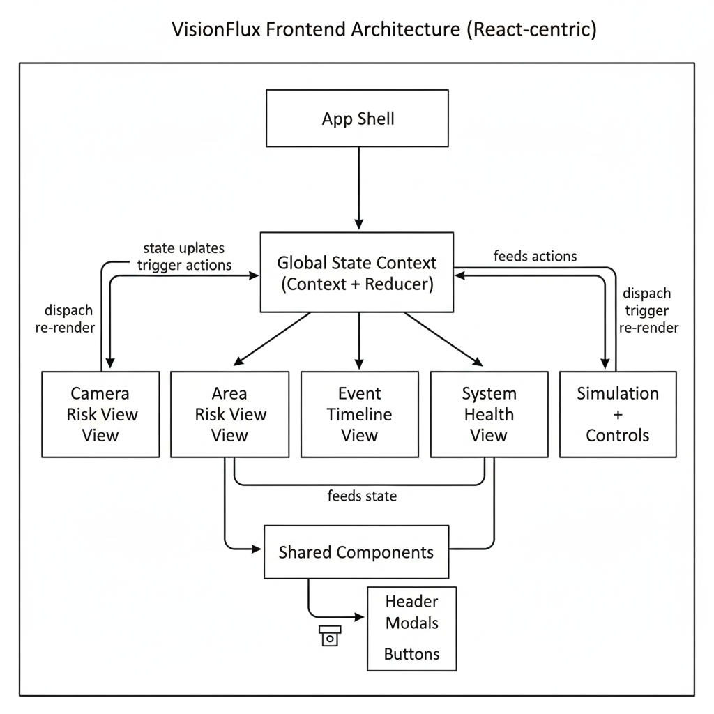
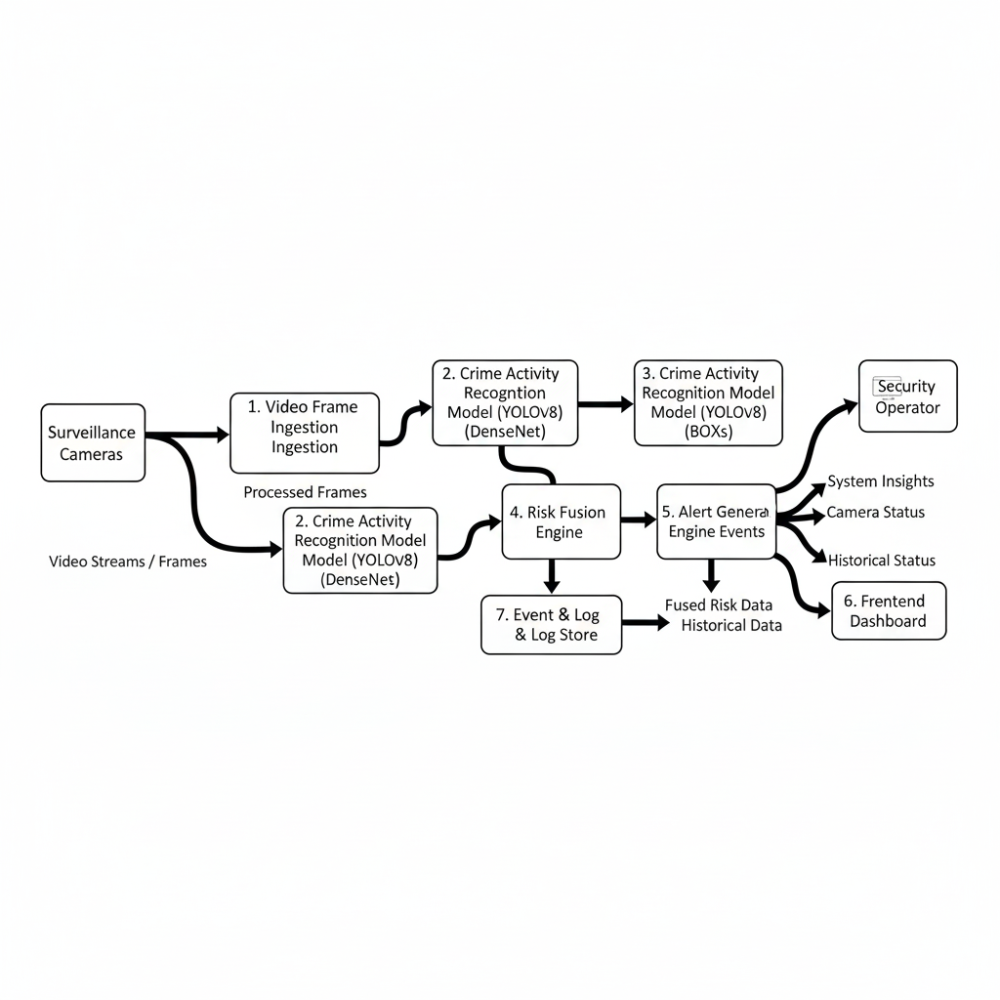
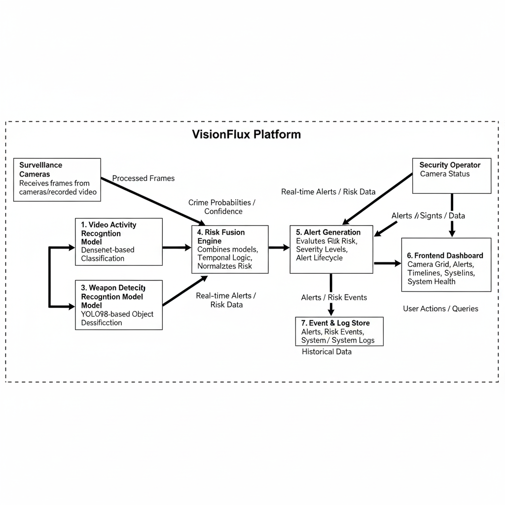
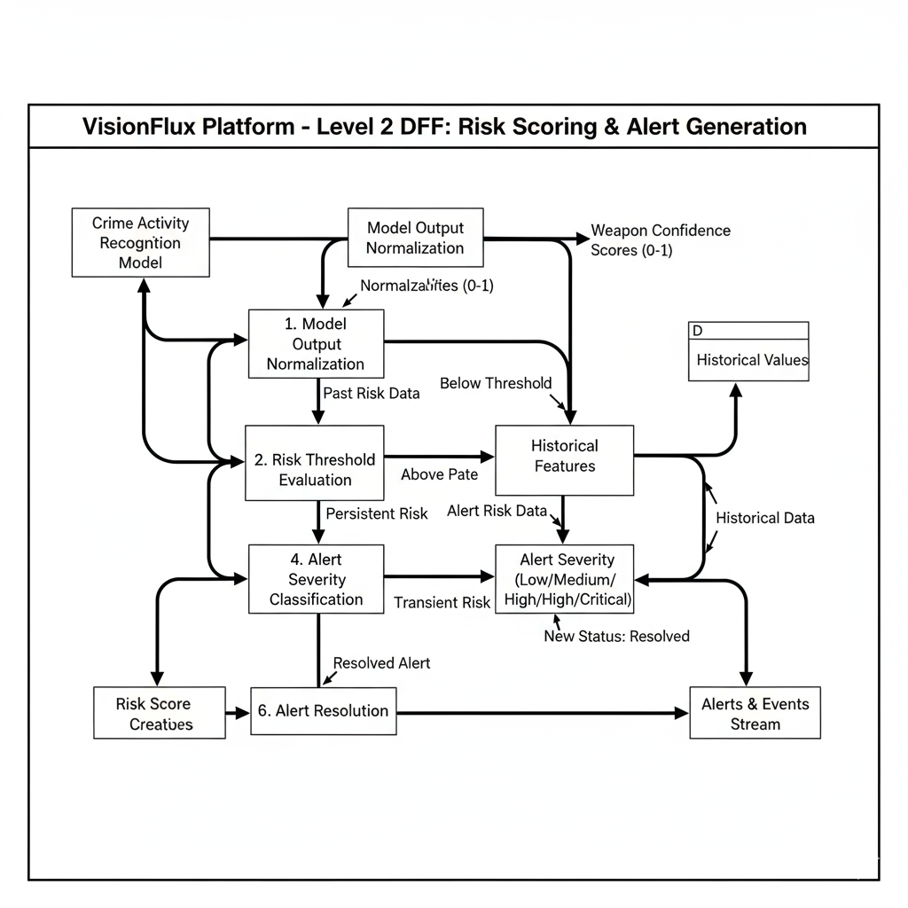
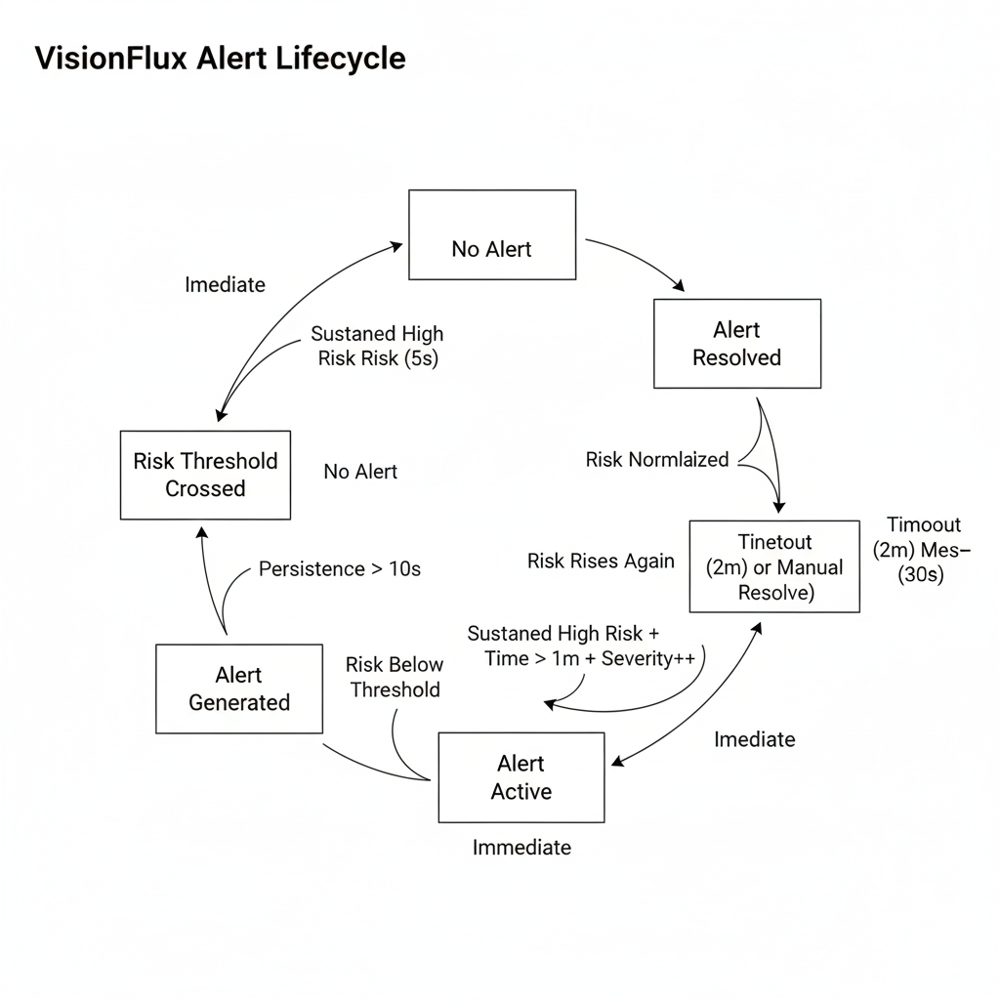
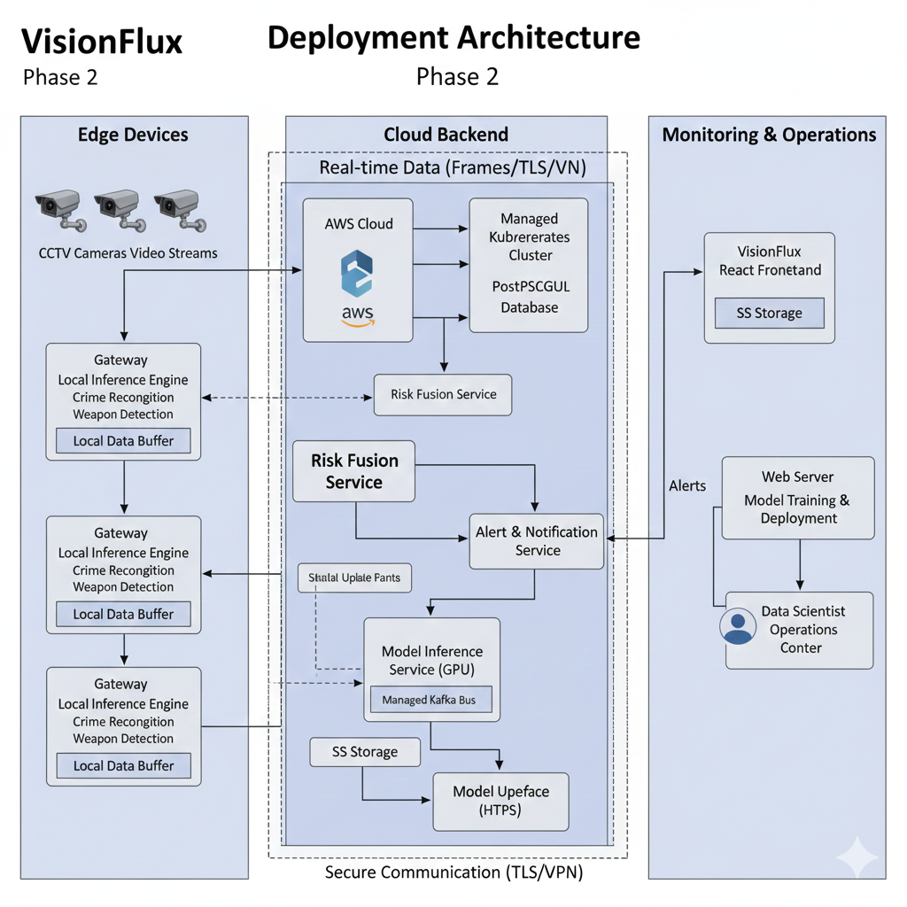

# VisionFlux  
## Intelligent Risk-Aware Surveillance Platform

---

##  Overview

**VisionFlux** is an intelligent surveillance platform designed to provide **real-time situational awareness, risk assessment, and operational transparency** for public safety environments.  

It goes beyond passive video monitoring by transforming visual inputs into **risk intelligence**, combining multiple AI models with a unified frontend dashboard to support **explainable, risk-aware decision making**.  

The platform is architected as a **modular, scalable system**, with clear separation between AI inference, risk logic, alerting, and visualization layers.

---

##  System Philosophy

VisionFlux is built on four core principles:

- **Risk-first monitoring** instead of raw video consumption  
- **Explainability** for every system decision  
- **Operator-centric design** for high-pressure environments  
- **Auditability and traceability** across the entire system  

---

##  High-Level System Components

VisionFlux consists of two major subsystems:

### 1 Backend Intelligence Layer

- AI-based crime activity recognition  
- Weapon detection and localization  
- Risk scoring and alert logic  

### 2 Frontend Command Center

- Risk-aware visualization  
- Alert monitoring and escalation  
- Event intelligence and system health tracking  

---

##  Backend – AI & Intelligence Layer

### Crime Activity Recognition

**Model Overview**  

- Multi-class crime activity recognition model  
- Trained on the **UCF-Crime dataset**  
- Backbone: **DenseNet121** with ImageNet pretraining  
- Input: RGB video frames resized to 64×64  
- Output: Probabilities across **14 crime-related activity classes**  

**Architecture**  

- DenseNet feature extractor  
- Fully connected classification head  
- Dropout-based regularization  
- Softmax output layer  

**Training & Evaluation**  

- Loss: Categorical Cross-Entropy  
- Optimizer: Stochastic Gradient Descent (SGD)  
- Evaluation Metric: ROC–AUC (micro-average)  

**Performance**  

- Overall ROC–AUC: ~0.84  
- Robust discrimination between violent and non-violent activities  
- Clear separation between normal and anomalous events  

---

### Weapon Detection System

**Model Overview**  

- Object detection–based weapon detection  
- Model: **YOLOv8** (Ultralytics, PyTorch)  

**Capabilities**  

- Detects and localizes weapons using bounding boxes  
- Outputs confidence scores per detection  
- Optimized for fast, GPU-accelerated inference  

**Pipeline**  

- Input image preprocessing  
- Single forward-pass detection  
- Bounding box visualization and confidence scoring  
- Deployment-ready trained model  

**Use Cases**  

- Public safety monitoring  
- Surveillance and threat detection  
- Security screening environments  

---

### Risk Fusion & Alert Logic

- Combines outputs from:  
  - Crime activity recognition model  
  - Weapon detection model  
- Applies:  
  - Confidence thresholds  
  - Temporal persistence checks  
  - Severity classification  
- Produces:  
  - Normalized risk scores  
  - Alert severity levels  
  - Alert lifecycle states (Active / Resolved)  

---

##  Frontend – Command Center Dashboard

The frontend serves as the **operational interface** for VisionFlux, providing real-time visibility into system intelligence and decision-making.

### Camera Risk View (Tactical Monitoring)

- Multi-camera grid layout  
- Per-camera: risk score, confidence, zone association, status (Normal / Suspicious / High Risk)  
- Automatic visual escalation for high-risk cameras  
- Click-to-expand camera modal with:  
  - Risk trends  
  - Alert history  
  - Camera metadata  
  - Zone information  

### Area Risk View (Strategic Awareness)

- Zone-level risk aggregation  
- Cross-camera risk fusion  
- Zone status indicators  
- System-wide KPIs  
- Abstract zone representation (non-geographic)  

### Event Intelligence Timeline (Explainability)

- Chronological audit trail of system behavior  
- Tracks:  
  - Risk changes  
  - Escalations and normalization  
  - Alert generation and resolution  
  - Zone-level updates  
  - System health transitions  
- Human-readable explanations answering:  
  > “Why did the system act?”  

### System Health & Readiness

- System mode indicator  
- Infrastructure health metrics  
- Active alert count  
- Camera availability  
- Operational dashboard layout  

---

##  Frontend Architecture

### State Management

- Centralized global state using **React Context + Reducer**  
- Manages: cameras, zones, alerts, event timeline, system health, UI state (modals, selections)  

### Simulation & Control

- Start / pause / reset controls  
- Speed adjustment  
- Manual override actions  
- Deterministic, state-driven updates  

### Logging & Audit

- Centralized logging service  
- Structured logs  
- CSV export support  

---

##  Project Structure

```text
├── backend/
│   ├── crime_activity_recognition/
│   ├── weapon_detection/
│   └── risk_fusion_logic/
├── frontend/
│   ├── src/
│   └── components/
├── docs/
│   ├── data-flow-diagram.md
│   └── database-schema.md
└── README.md

##  Tech Stack

**Backend**  

- PyTorch  
- DenseNet121  
- YOLOv8 (Ultralytics)  
- GPU-accelerated training & inference  

**Frontend**  

- React (Vite)  
- Tailwind CSS  
- React Context + Reducer  
- Lucide React Icons  

---

## ▶ Running the Frontend Locally

**Prerequisites**  

- Node.js (v18+ recommended)  
- npm  

**Setup**  

```bash
git clone https://github.com/Jiyaaaa21/VisionFlux-Intelligent-Risk-Aware-Surveillance-Platform

cd surveillance-dashboard
npm install
npm run dev

Open in browser:
http://localhost:3000


## 📐 Architecture & Data Flow Diagrams


### Overall System Architecture


### Frontend Architecture


### System Context (DFD – Level 0)


### Core System Breakdown (DFD – Level 1)


### Risk & Alert Processing Flow


### Alerting Architecture


### Deployment Architecture



These documents describe:  

- End-to-end data movement  
- Model-to-risk-to-alert flow  
- Storage and audit design  

---

##  Roadmap (Phase 2+)

### Backend Enhancements

- Temporal modeling (CNN–LSTM, TCN, 3D CNNs)  
- Attention mechanisms  
- Higher-resolution inputs  
- Class imbalance mitigation  
- Multi-modal learning (optical flow, audio)  
- Model optimization (pruning, quantization, TensorRT)  

### System & Deployment

- Real-time inference services  
- Live camera ingestion (RTSP / IP streams)  
- Edge and cloud deployment  
- Scalable alerting pipeline  

### Frontend Enhancements

- Live updates via WebSockets  
- Incident export and reporting  
- Role-based access control (RBAC)  
- Operator acknowledgement workflows  

---

##  Disclaimer

VisionFlux is a research and demonstration prototype developed for academic and evaluative purposes.  
It does **not perform automated enforcement or real-world surveillance actions**.

---

## 👥 Team

VisionFlux is developed as a collaborative effort across:  

- AI & Backend Intelligence  
- Frontend Visualization & UX  
- System Design & Architecture

