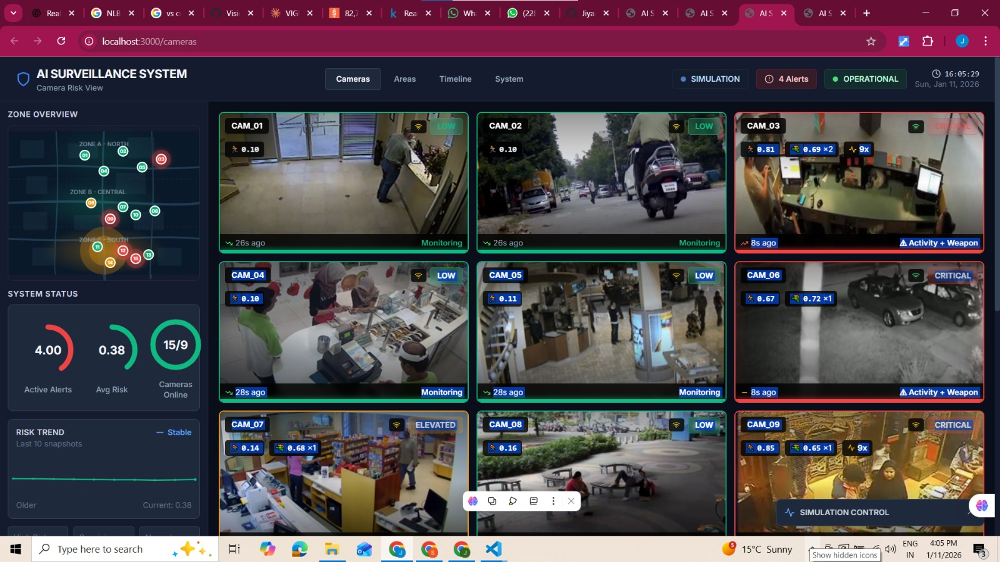
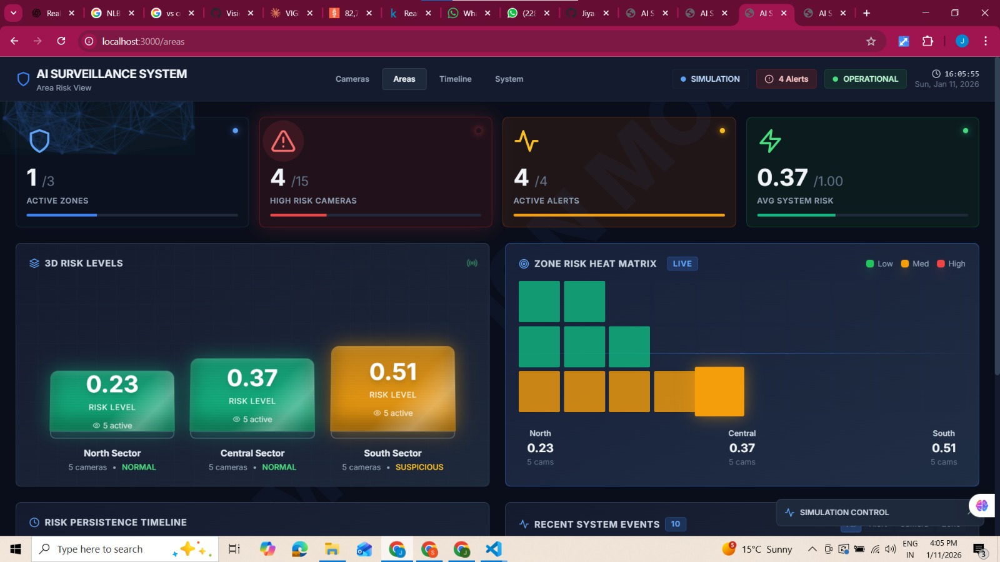
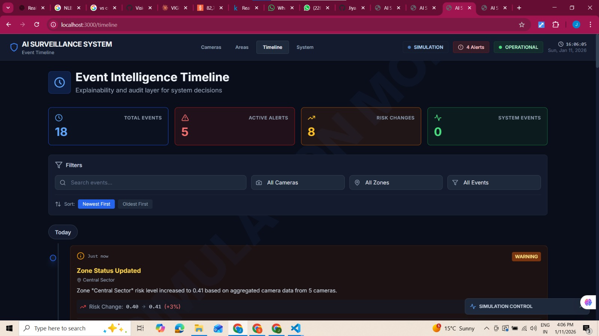
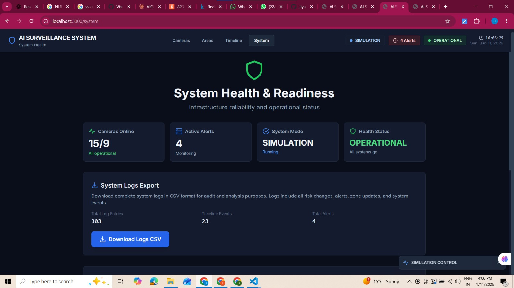

# VisionFlux

## Intelligent Risk-Aware Surveillance Dashboard

---

##  Overview

VisionFlux is an intelligent surveillance platform engineered to deliver **real-time situational awareness, risk assessment, and operational transparency** for public safety and security environments.

Unlike traditional surveillance systems that rely on passive video monitoring, VisionFlux emphasizes **risk intelligence, explainability, and decision traceability**. The platform transforms visual signals into actionable insights by combining camera-level analysis, area-level aggregation, alerting logic, and a comprehensive audit trail of system behavior.

This repository contains the **complete frontend implementation** of VisionFlux, along with architectural documentation required for evaluation and further system integration.

---

## Core Design Philosophy

VisionFlux is built around the following principles:

* **Risk-first monitoring** rather than raw video consumption
* **Explainability** as a first-class system feature
* **Operator-centric design** for clarity under pressure
* **Modular, backend-agnostic architecture** for scalability
* **Auditability and traceability** of every system decision

---

##  Platform Capabilities

### 1 Camera-Level Intelligence

* Multi-camera monitoring dashboard (3×3 grid)
* Per-camera risk score and confidence visualization
* Status classification: Normal / Suspicious / High Risk
* Automatic visual escalation for high-risk cameras
* Detailed drill-down via camera modal:

  * Risk trends
  * Confidence metrics
  * High-risk frame persistence
  * Alert history
  * Camera and zone metadata

---

### 2 Area-Level Situational Awareness

* Zone-based risk aggregation
* Area status indicators derived from multiple cameras
* Risk persistence monitoring across time
* Strategic view for macro-level decision making
* Abstract zone representation (intentionally non-geographic)

---

### 3 Event Intelligence & Explainability

* Chronological event timeline capturing system behavior
* Tracks:

  * Risk escalations and normalizations
  * Alert creation and resolution
  * Zone-level risk changes
  * System health transitions
* Human-readable explanations for each system action
* Filterable by camera, zone, and event type
* Designed to answer:

  > **“Why did the system take this action?”**

---

### 4 System Health & Operational Readiness

* System mode visibility (Simulation / Operational)
* Infrastructure health indicators
* Active alert count
* Camera availability status
* Monitoring-style dashboard aligned with real-world control rooms

---

##  Frontend Architecture

### State Management

* Centralized global state using **React Context + Reducer**
* Unified handling of:

  * Cameras
  * Zones
  * Alerts
  * Event timeline
  * System health
  * UI state (modals, highlights, selections)

### Simulation & Control Layer

* Playback control (start, pause, reset)
* Speed control for system progression
* Manual override actions for testing escalation logic
* Deterministic, state-driven updates across the platform

### Logging & Audit

* Centralized logging service
* Structured logs for:

  * Risk changes
  * Alerts
  * Zone updates
  * System status transitions
* CSV export for offline analysis and auditing

---

##  Project Structure

```text
src/
├── components/
│   ├── Page1_CameraRiskView/
│   ├── Page2_AreaRiskView/
│   ├── Page3_EventTimeline/
│   ├── Page4_SystemHealth/
│   └── shared/
├── context/
│   └── GlobalStateContext.jsx
├── hooks/
│   └── useSimulation.js
├── services/
│   └── loggerService.js
├── utils/
│   ├── constants.js
│   └── timelineHelpers.js
├── App.jsx
├── main.jsx
├── index.jsx
└── index.css
```

---

🛠️ Tech Stack

Framework: React (Vite)

Styling: Tailwind CSS (custom dark dashboard theme)

State Management: React Context + Reducer

Icons: Lucide React

Build Tooling: Vite

Architecture: Component-driven, backend-agnostic

---

▶️ Running the Project Locally

### Prerequisites

* Node.js (v18+ recommended)
* npm

### Setup

```bash
git clone https://github.com/Jiyaaaa21/VisionFlux-Intelligent-Risk-Aware-Surveillance-Platform
cd surveillance-dashboard
npm install
```

### Start Development Server

```bash
npm run dev
```

Open in browser:

```
http://localhost:3000
```

---

🖼️ Frontend Prototype Images
## 🖼️ Frontend Dashboard Screenshots

### Camera Risk View


### Area Risk View


### Event Intelligence Timeline


### System Health Dashboard



---

These documents describe:

* End-to-end data movement
* Risk processing flow
* Alert lifecycle
* Storage and audit design

---

# Current State

* Fully functional, production-style frontend
* Risk-aware visualization beyond raw video feeds
* Transparent and explainable system behavior
* Modular and scalable UI architecture
* Designed for seamless real-time backend integration

---

## Roadmap (Phase 2+)

### Backend & System

* Real-time inference services
* Live camera ingestion (RTSP / IP streams)
* Risk fusion from model probabilities
* Scalable alerting and notification pipeline
* Edge and cloud deployment support

### Frontend

* Live updates via WebSockets
* Incident export and reporting
* Role-based access control (RBAC)
* Operator acknowledgement and workflow tooling

---

⚠️ Disclaimer
VisionFlux is a research and demonstration prototype developed for academic and evaluative purposes.
It does not perform automated enforcement or real-world surveillance actions.

---

 Team – Frontend
Frontend design and implementation by the VisionFlux frontend team, focusing on:

* Risk visualization
* Explainability
* System usability
* Operational awareness
